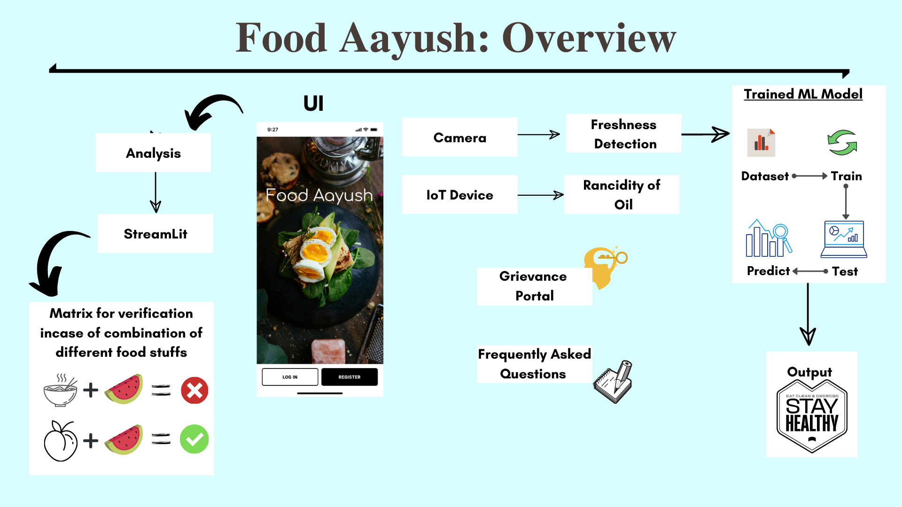

# FoodAayush

### Incase you want to skip the documentation part 🥱 jump to the output directly 😎

#### Streamlit
#### https://food-aayush.herokuapp.com/
#### Flutter
#### https://drive.google.com/file/d/1lxsCGpZCQmsy9IQyMJjI9kl7kz3Ezx4p/view?usp=sharing
#### Youtube Tutotrial
#### https://youtu.be/fQFuHKvCv1E
#### Accomplishments and Publications
#### https://www.linkedin.com/posts/narenkhatwani_i-am-happy-to-share-that-our-be-project-group-activity-6793489449914273793-VpEJ?utm_source=share&utm_medium=member_desktop

#### https://link.springer.com/book/10.1007/978-3-030-92905-3

#### Abstract ####

**Food is an essential parameter that plays an important role in the survival of humans. It also plays a major part in depicting a country’s culture. Healthy, nutritious, and high-quality food results in not only a better lifestyle but also develops a person’s immunity and health. Likewise, the consumption of low-quality food which might be deprived of nutritional value impacts a person’s health negatively and makes them susceptible to all types of diseases. In India, there is a persistent complaint, in any civic body-related food section, about the quality of meals available. Likewise, the quality of the oil is also an important factor while cooking any meal. Therefore, the Quality of oil used in frying the food to affect its taste must be monitored too. Its continuous exposure to relatively high temperatures results in degradation of its quality. The purpose of this study is to build an application for the detection of the quality of food and also to detect repeated frying on cooking oils based on the visual properties of the oils. Classification of food items is done on the basis of time left for consumption, edibility, quality, color, and rancidity. The food items are further classified as stale or usable using artificial intelligence algorithms based on the images acquired through a Cell Phone’s camera.**

**Mentor** - Prof Richard Joseph

**Project Collaborators:**

Streamlit - Naren Khatwani and Adithya Shrivsatava

Flutter App - Rahul Sohandani

Flutter UI - Rahul Sohandani and Adithya Shrivastava 

IoT Device - Raghav Potdar

Image Classification Model - Rahul Sohandani and Raghav Potdar

